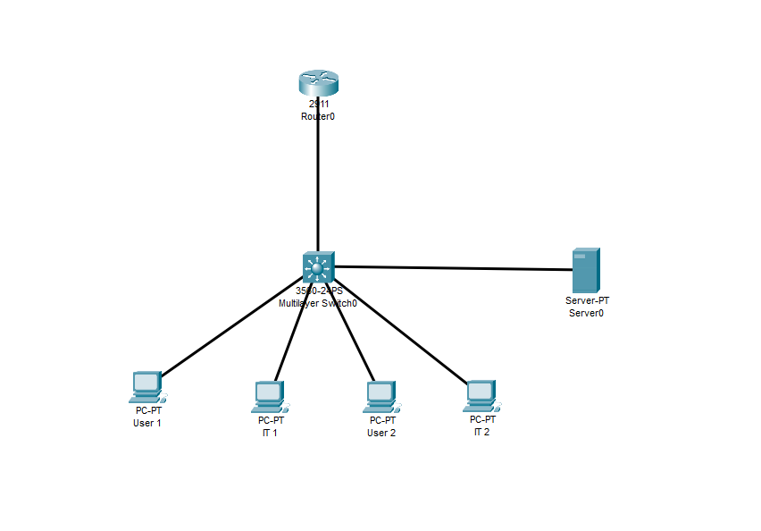
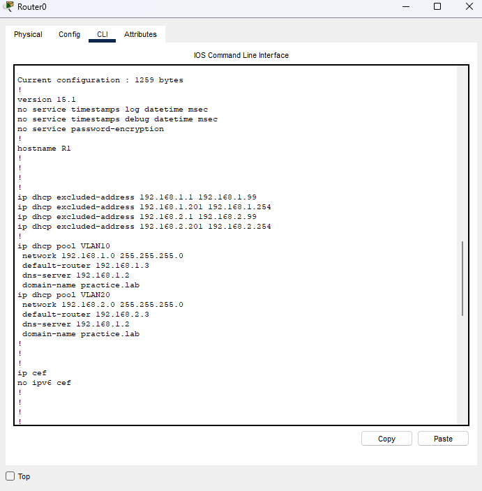
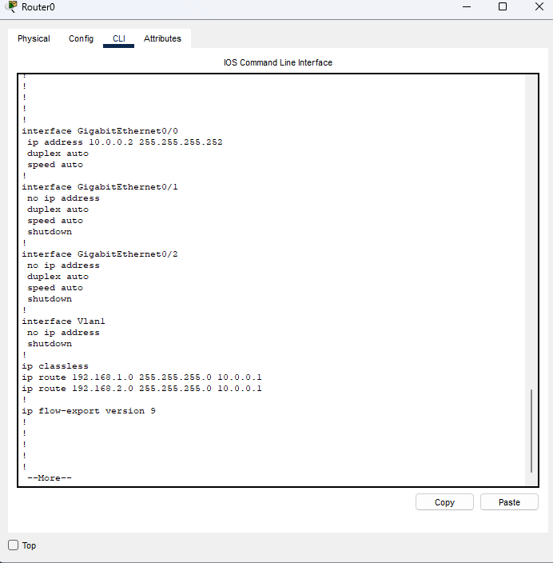
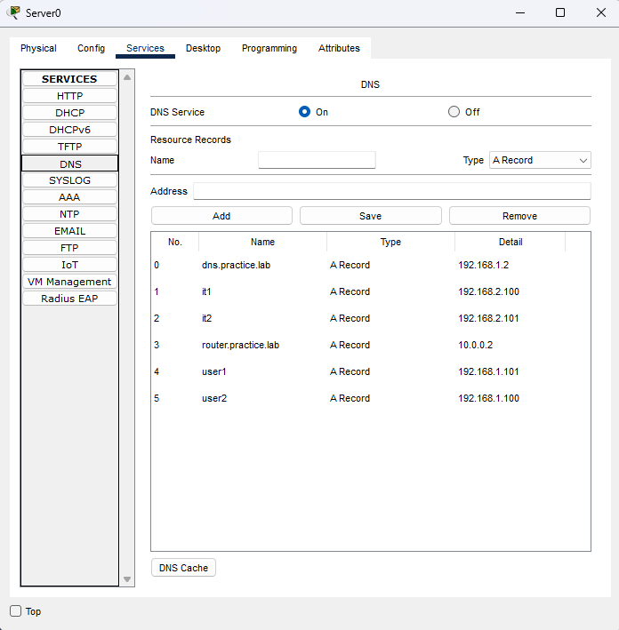
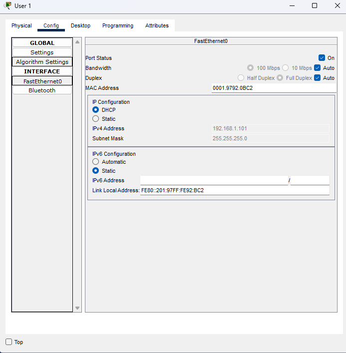
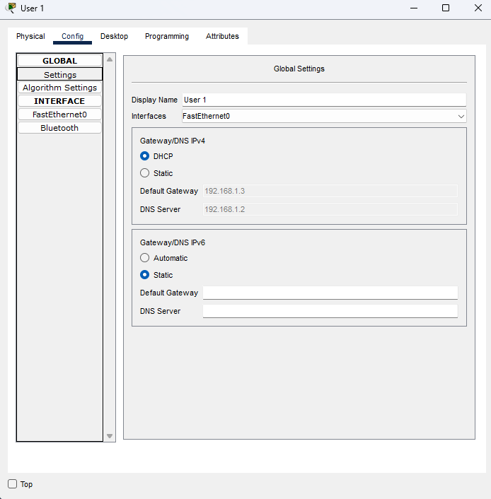

# DHCP per-VLAN & DNS-server
Multi-vlan enterprise network simulation via Cisco Packet Tracer

## Overview
Simulated an enterprise network topology using a Layer-3 switch for inter-VLAN routing, a router providing centralized DHCP services, and a centralized DNS server to enable hostname-based communication across the VLAN. This design reflects a common enterprise pattern where infrastructure services are centralized while VLANs segment end users by department.

## Network devices and topology
* 1 Router
* 1 Layer-3 Switch
* 1 DNS Server
* 4 End Hosts  

## VLAN Design
* VLAN 10: Users - 192.168.1.0/24
* VLAN 20: IT - 192.168.2.0/24
* Router-to-Switch uplink: 10.0.0.0/30

## Configurations and Why

### Layer-3 Switch
* Created VLAN 10 and VLAN 20 with SVIs as default gateways for each segment
* Enabled inter-VLAN routing on the switch, routing VLAN 10 and VLAN 20 traffic locally through the switch to reduce unnecessary upstream traffic
* Configured 'ip helper-address 10.0.0.2' on each SVI to forward DHCP broadcast requests to the centralized router across VLAN boundaries
* Configured Fa0/6 as a router port via 'no switchport' with an IP of 10.0.0.1/30 for the point-to-point uplink to the router
* Added a default route 0.0.0.0/0 via 10.0.0.2 so the switch can forward any traffic it cannot route locally  

### DHCP Services
* Created separate DHCP pools per VLAN with correct network, default gateway (SVI IP), DNS server, and domain name
* VLAN 10 pool: gateway '192.168.1.3', DNS '192.168.1.2', domain 'practice.lab'
* VLAN 20 pool: gateway '192.168.2.3', DNS '192.168.1.2', domain 'practice.lab'  

### Routing
* Configured 10.0.0.2/30 on Gi0/0 as the uplink to the L3 switch
* Added static routes for '192.168.1.0/24' and '192.168.2.0/24' via '10.0.0.1' so the router knows how to return DHCP offers and DNS responses back to clients in each VLAN. Without these routes, DHCP relay responses would have no return path.  

### DNS
* Deployed DNS server at 192.168.1.2 serving both VLANs via the centralized DNS server address distributed by DHCP
* Created A records for all hosts and infrastructure devices
* DNS A records configured:
  - dns.practice.lab: 192.168.1.2
  - router.practice.lab: 10.0.0.2
  - user1: 192.168.1.101
  - user2: 192.168.1.100
  - it1: 192.168.2.100
  - it2: 192.168.2.101  
  
 
## Validation

### DHCP Lease Validation
* User 1 received 192.168.1.101/24, gateway 192.168.1.3, DNS 192.168.1.2
* IT2 received 192.168.2.101/24, gateway 192.168.2.3, DNS 192.168.1.2
* All clients received correct per-VLAN gateway confirming DHCP relay forwarded requests to the correct pool  

## Observations
* DHCP relay enables centralized DHCP in a multi-VLAN environment because without it each VLAN would require its own local DHCP server
* Inter-VLAN routing at the L3 switch keeps local inter-VLAN traffic off the router reducing upstream traffic
