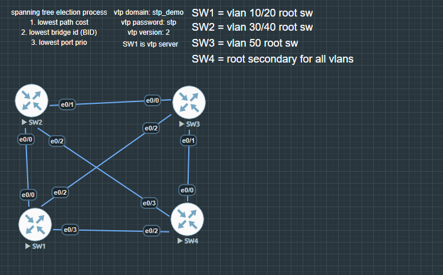
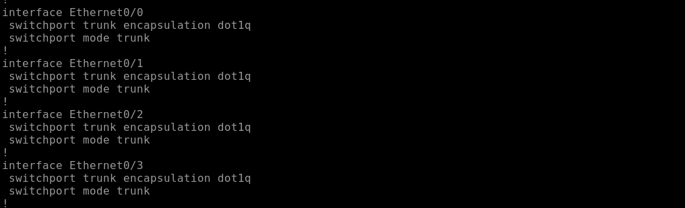
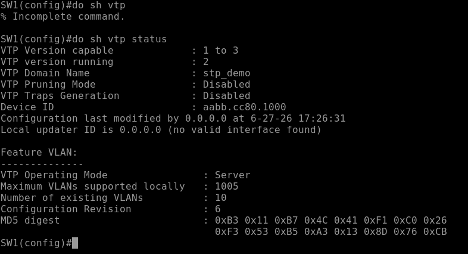
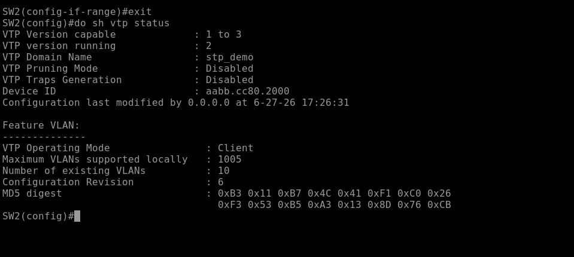
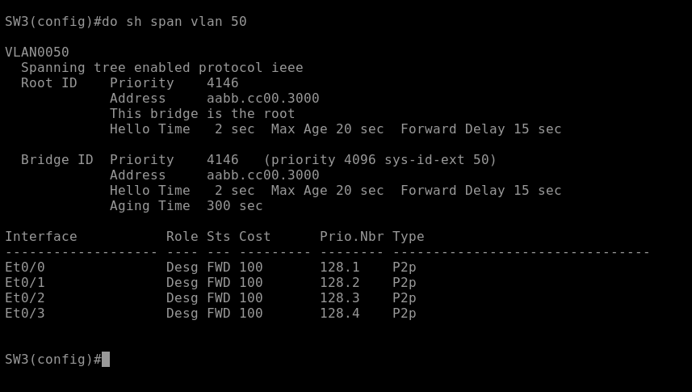
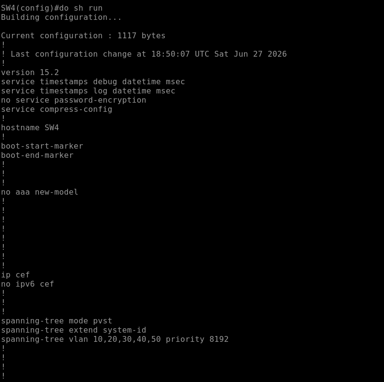
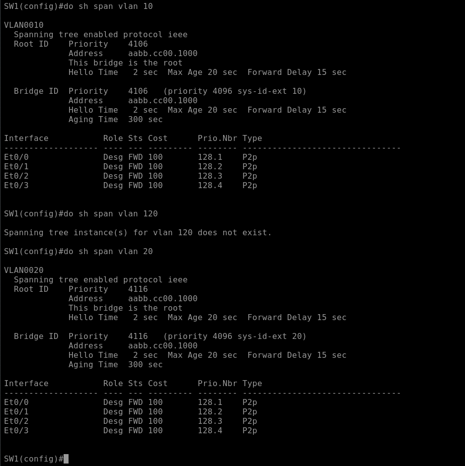
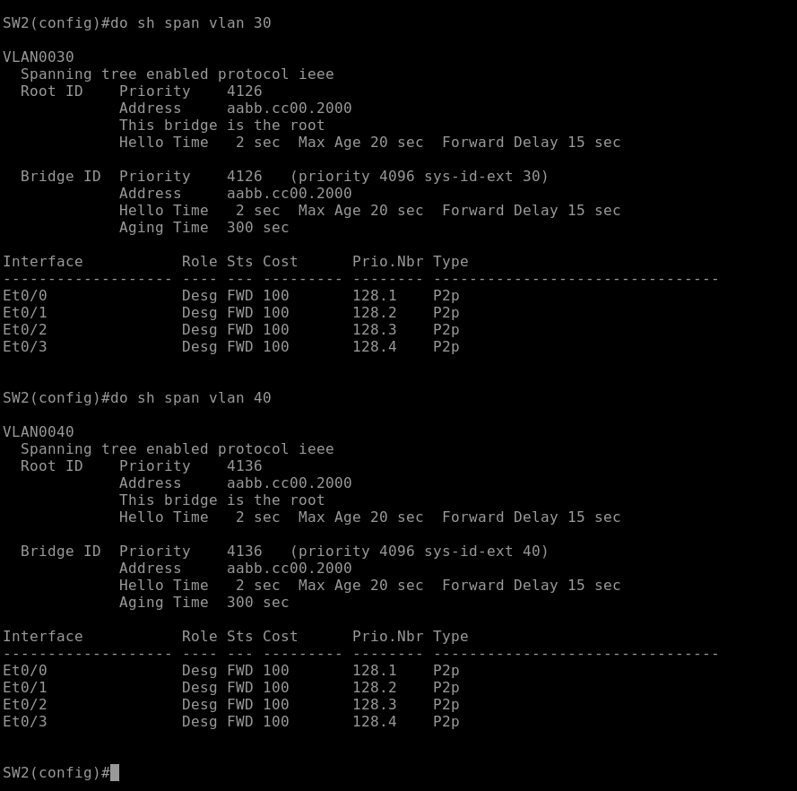
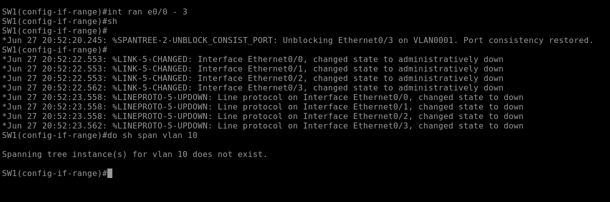
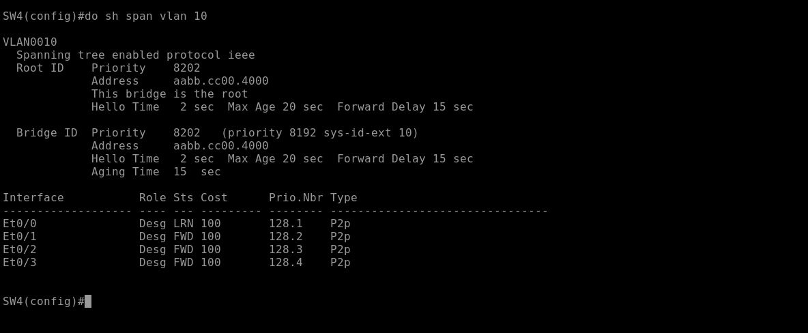

# Multi-VLAN STP with Failover testing

## Objective
This lab aims to demonstrate my knowledge and ability to configure and verify STP functionality within a multi-VLAN pvst environment. I will be configuring different primary and secondary root bridges based on the VLAN, verifying port role changes across VLANs, and testing failover behavior when a root bridge fails. 

## Topology

- 4 Switches in a full mesh
- SW1 in VTP server mode and SW2 - 4 as client mode
- SW1 as the root bridge for VLAN 10, 20
- SW2 as the root bridge for VLAN 30, 40
- SW3 as the root bridge for VLAN 50
- SW4 as the secondary bridge for VLAN 10, 20, 30, 40, 50

## Configurations and why

### Trunk Links
- Ran 'interface range e0/0 - 3' followed by 'switchport trunk encapsulation dot1q' and 'switchport mode trunk' to configure the trunk links encapsulation type to the open standard Dot1q and to configure each links operational mode as a trunk link. I've repeated this on all switches. This change is needed to allow vtp messages to be sent between switches. 

### VTP
- Ran 'vtp domain stp_demo', 'vtp password stp', 'vtp version 2', and 'vtp mode server' on SW1 to create a vtp domain and appoint a vtp server
- Ran 'vtp domain stp_demo', 'vtp password stp', 'vtp version 2', and 'vtp mode client' on SW2 - 4 to appoint vtp clients
- A VTP server/client relationship was created to allow VLAN creations such as VLAN 10 - 50 to propagate across all switches

### STP
- Ran 'spanning-tree mode pvst' to configure per-VLAN spanning tree on all switches
- Ran 'spanning-tree vlan 10 priority 4096' and 'spanning-tree vlan 20 priority 4096' on SW1 to elect SW1 as the root bridge for vlan 10 and 20
- Ran 'spanning-tree vlan 30 priority 4096' and 'spanning-tree vlan 40 priority 4096' on SW2 to elect SW2 as the root bridge for vlan 30 and 40
- Ran 'spanning-tree vlan 50 priority 4096' on SW3 to elect SW3 as the root bridge for VLAN 50
- Ran 'spanning-tree vlan 10 priority 8192' 'spanning-tree vlan 20 priority 8192' 'spanning-tree vlan 30 priority 8192' 'spanning-tree vlan 40 priority 8192' 'spanning-tree vlan 50 priority 8192' on SW4 to elect SW4 as the secondary (failover) root bridge for each VLAN

## Validation of proper STP port roles per VLAN

### Port role valiation per VLAN
Comparing 'do show spanning-tree vlan 10' on VLAN 10's root bridge (SW1) against 'do show spanning-tree vlan 30' on VLAN 30's root bridge (SW2) shows different port states. This confirms that each VLAN runs its own independent STP instances.

### Failover Test for VLAN 10
1. Shut down all links to SW1
2. Observed convergence delay of approximately 50 seconds before the secondary root, SW4, took over as root bridge for VLAN 10
3. Validated SW4's convergence via the output from 'do show spanning-tree vlan 10' on SW4
4. Re-enabled links to SW1, causing SW1 to reclaim root bridge after reconvergence due to its lower priority

## Observations and Lessons Learned
Initial failover test appeared as SW4 wasn't showing as root immediately after shutting down SW1's links. However, this wasn't due to a misconfiguration in STP. This was a result of STP's Max Age time of 20 seconds and Listening/Learning state transitions of 15 seconds each during the convergence process. Given the time these processes take, it takes roughly 50 seconds to a minute for the secondary root bridge to fully take over.

While 50 to 60 seconds may seem minusule, in an enterprise environment that downtime could have significant impact on a business operations. The convergence process of pvst really highlights the direct motivation for Rapid-pvst implementation in enterprise environments.
