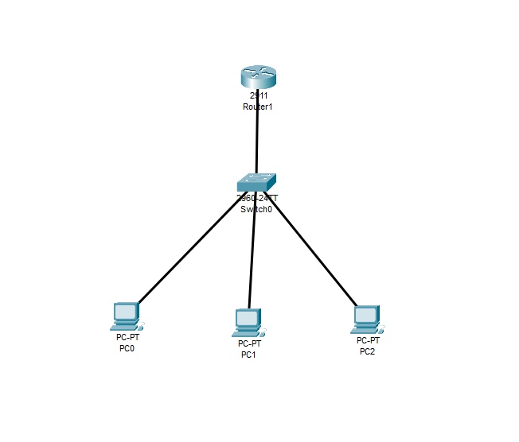
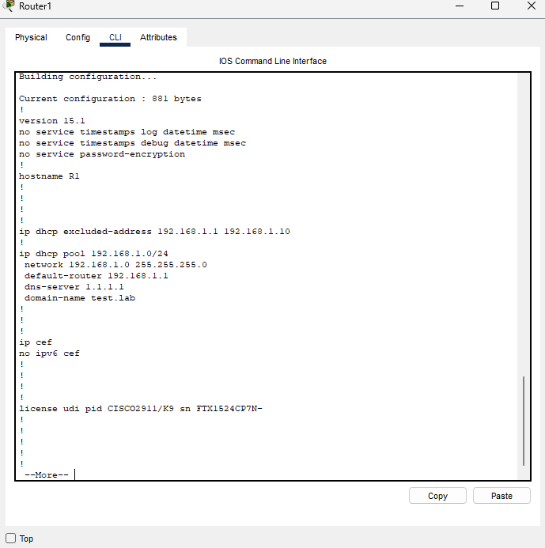
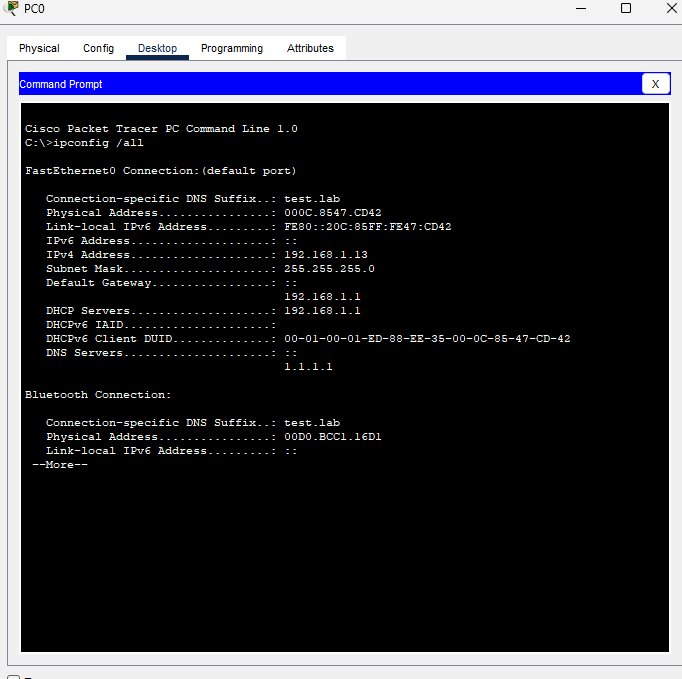
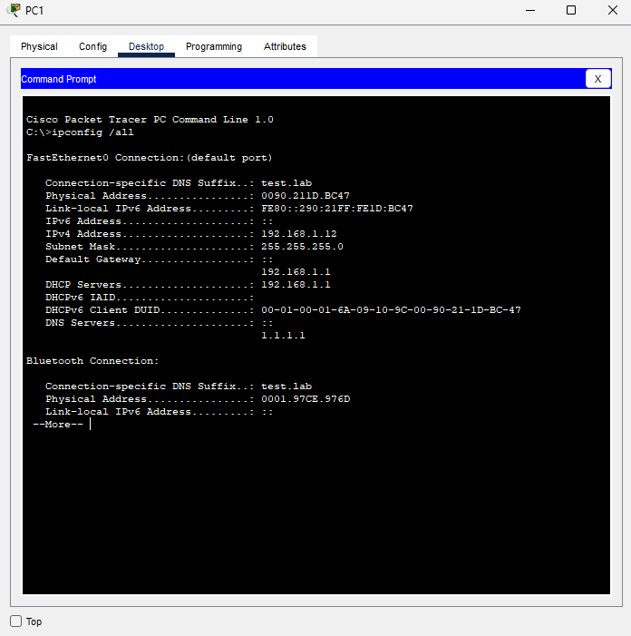
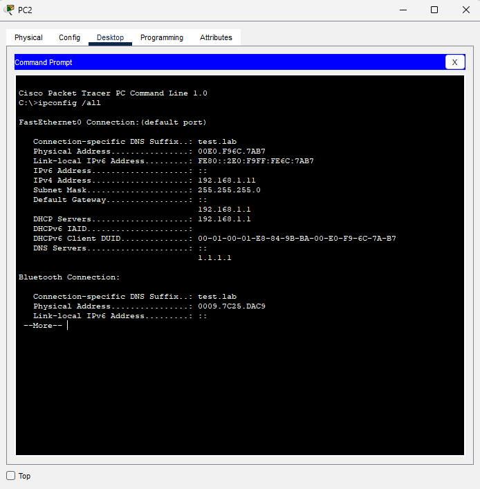
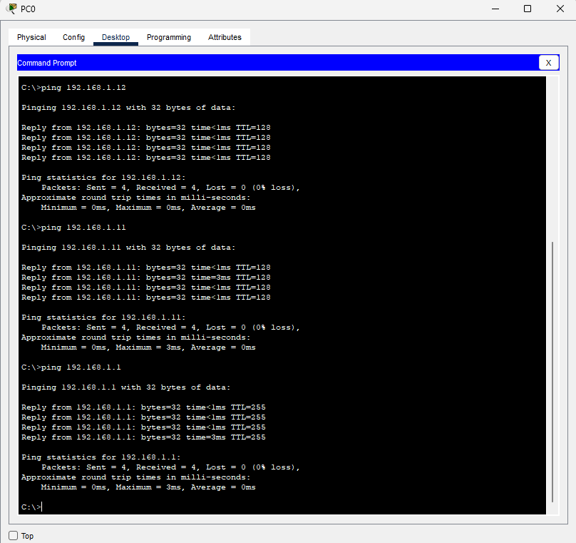

# Router DHCP Server - Single LAN Deployment
A simple LAN DHCP configuration deployment via Cisco Packet Tracer

## Overview
Designed and implemented a simple single-LAN network to demonstrate foundational Layer 1-3 connectivity, router interface configuration, and DHCP address assignment. This reflects a foundational enterprise deployment pattern where a router acts as both the default gateway and the DHCP server for end hosts on a local network.

## Topology and Configurations
Devices
* 1 Router
* 1 Switch
* 3 End Hosts  

## Key Tasks
* Configured GigabitEthernet0/0 with the IP 192.168.1.1/24 as the LAN gateway interface
* Reserved the IP range of 192.168.1.1 - 192.168.1.10 for potential infrastructure devices
* Defined DHCP pool with network, default gateway, DNS Server: 1.1.1.1, and a domain name: test.lab
* Validated successful IP lease and client communication via ping test between hosts

## Configurations
* Network Address: 192.168.1.0 255.255.255.0 (/24)
* Excluded Address: 192.168.1.1 - 192.168.1.10
* Default-router: 192.168.1.1
* DNS-Server: 1.1.1.1
* Domain-name: test.lab  

## Validation
* All three PCs received IPS from the pool (192.168.1.11 - 192.168.1.13)
* DHCP server, default gateway, and DNS server confirmed via ipconfig /all

* PC0 successfully pinged PC1 (192.168.1.12), PC2 (192.168.1.11), and the default gateway (192.168.1.1) with 0% packet loss

