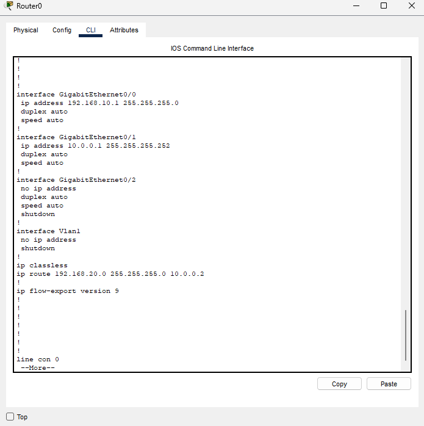
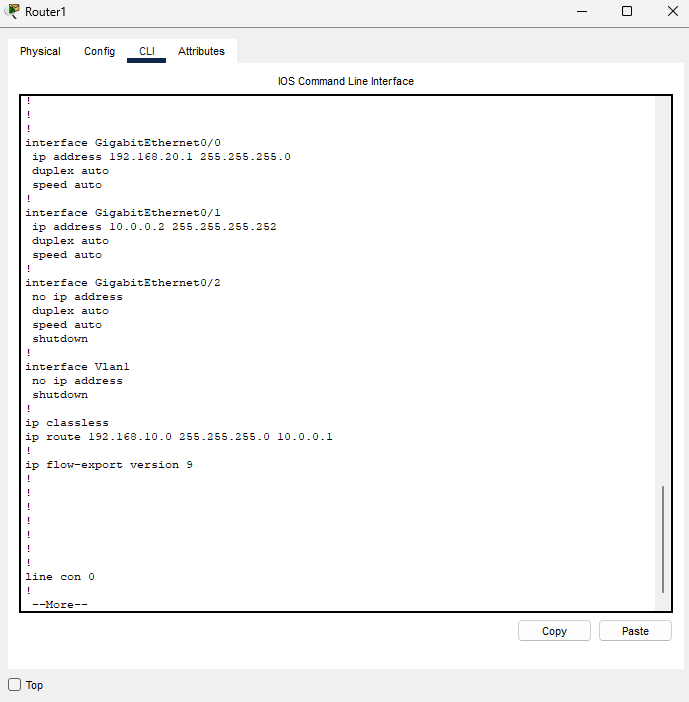
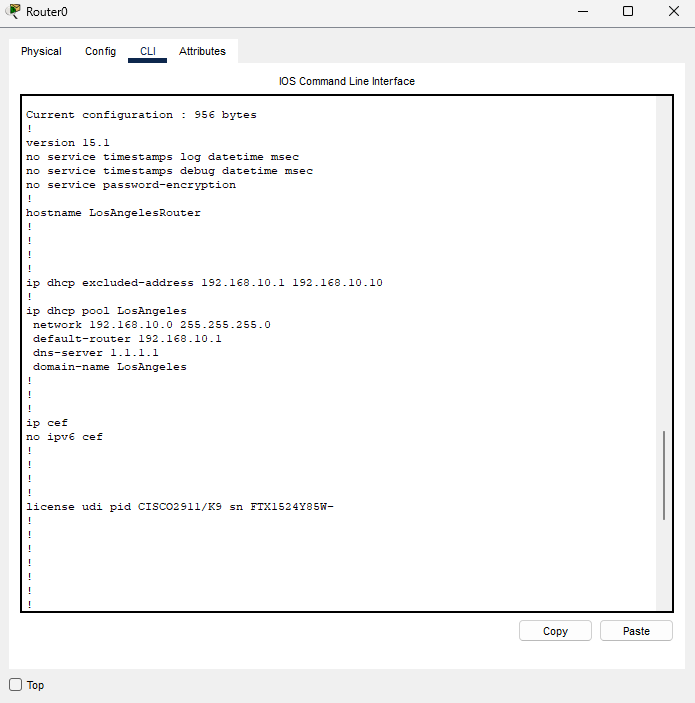
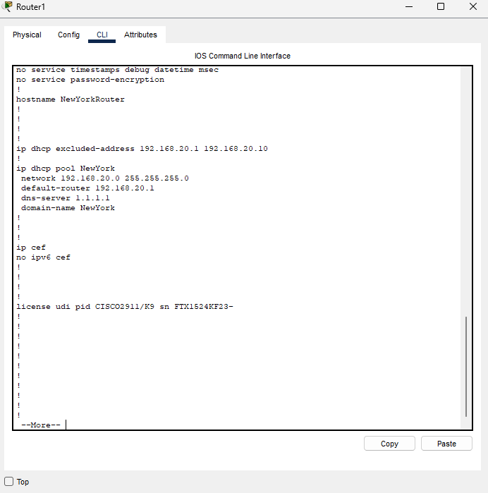
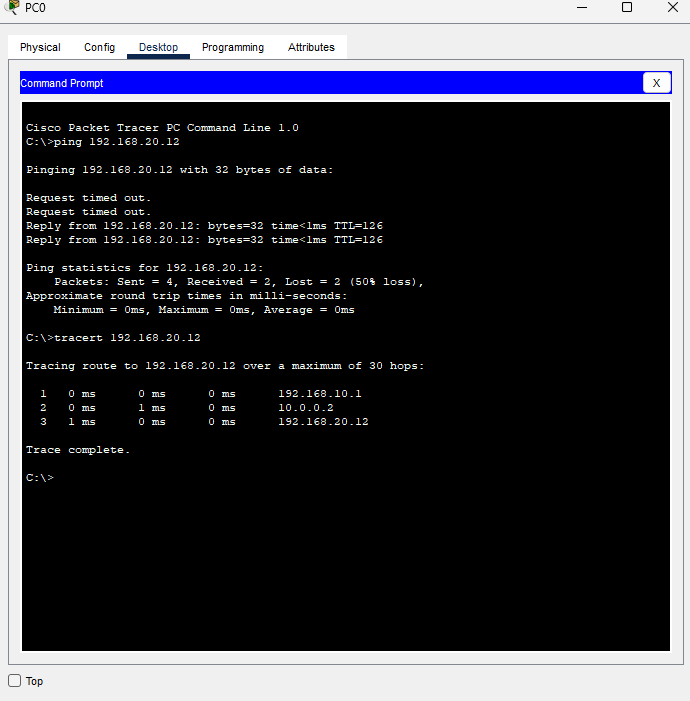

# Static routing between LANs
Configuring Inter-LAN connectivity via manually configured static routing on Cisco Packet Tracer

## Overview
Built a two-site topology simulating a Los Angeles and New York office connected over a point-to-point WAN link. Demonstrated Layer 3 routing between separate LANs using manually configured static routes and validated end-to-end connectivity using ping and traceroute.

## Topology and Networks
* LAN A (Los Angeles): 192.168.10.0/24
* LAN B (New York): 192.168.20.0/24
* WAN Link: 10.0.0.0/30  

## Configurations and Why

### Router Interfaces
* Configured LAN-facing interfaces as default gateways for each site's end hosts
* Configured WAN-facing interfaces with a /30 point-to-point subnet (a /30 provides exactly 2 usable host addresses which is the minimum needed for a router-to-router link) conserving IP address space  

### Static Routes
* On LosAngelesRouter I ran 'ip route 192.168.20.0 255.255.255.0 10.0.0.2' to be able to route NY-bound traffic toward NewYorkRouter
* On NewYorkRouter I ran 'ip route 192.168.10.0 255.255.255.0 10.0.0.1' to be able to route LA-bound traffic toward LosAngelesRouter

### DHCP
* Configured local DHCP pools on each router to automatically assign IPs to end hosts within each site
* LA pool: network 192.168.10.0/24 and gateway 192.168.10.1
* NY pool: network 192.168.20.0/24 and gateway 192.168.20.1
* Excluded .1 through .10 on each router to reserve addresses for infrastructure use  

## Validation

### Ping Test
* PC0 (LA, 192.168.10.x) successfully pinged PC2 (NY, 192.168.20.12) confirming end-to-end inter-LAN communication via static routes  

## Observations
* Initial ping showed 50% packet loss (2 of 4 packets timed out) before recovering. This is caused by an ARP resolution delay on first contact. During this time the router must ARP for the next hop MAC address before forwarding the first packet, causing the initial timeout. The following packets succeed immediately once the ARP table is populated.
* The traceroute hop count and IP addresses confirm traffic is following the correct path through the WAN link
* Static routing requires manual configuration on both routers. Each router only knows about the other's LAN through the explicitly configured static route. Removing either route breaks connectivity in one direction while the other direction remains functional, highlighting the non-symmetric nature in static route configurations
