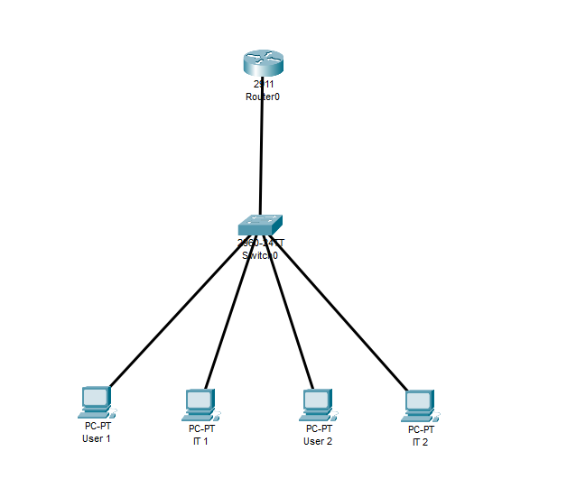
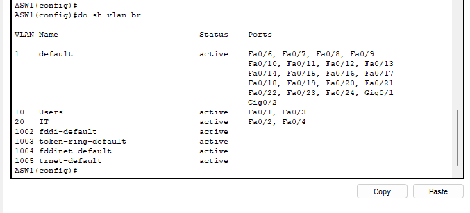
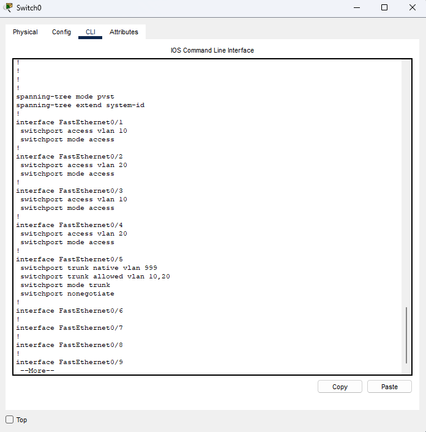
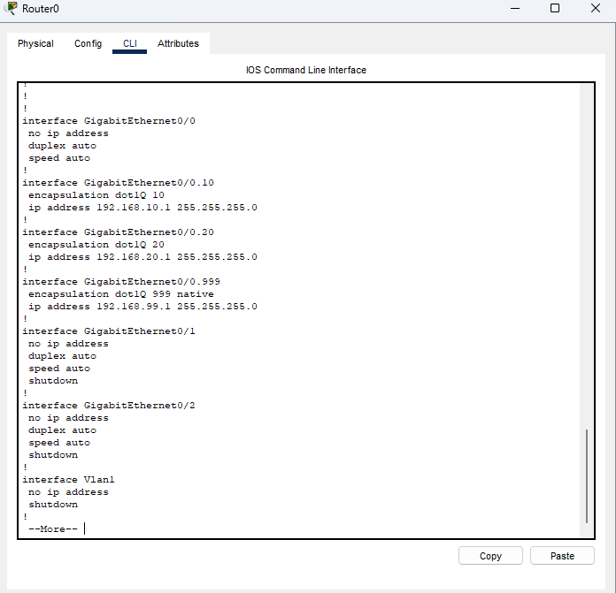
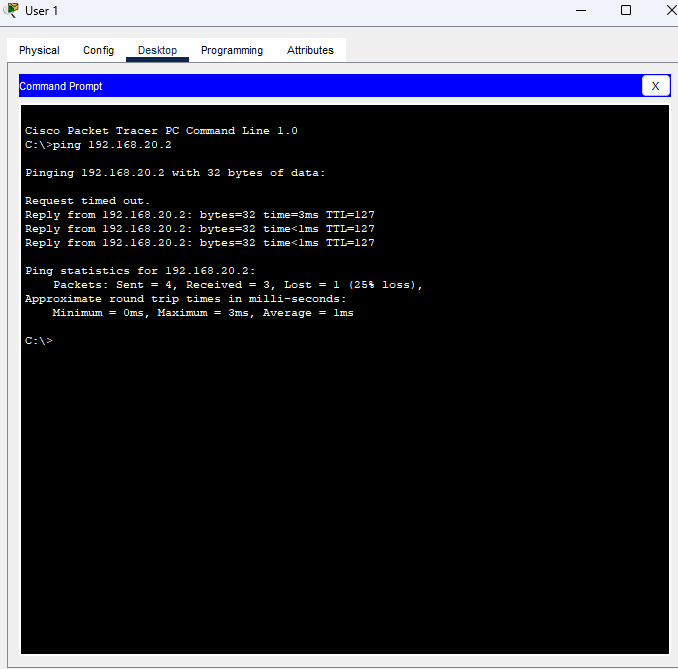

# VLAN Segmentation and Inter-VLAN Routing via Router on a Stick (ROAS)
VLAN segmentation with Inter-VLAN routing via Router on a stick (ROAS) configuration 

## Overview
Implemented VLAN-based network segmentation to isolate department traffic and enable controlled inter-VLAN communication using a router-on-a-stick configuration. Applied native VLAN hardening and DTP disable as security best practices. This design reflects a common small enterprise deployment where a single uplink carries multiple VLANs to a router for inter-VLAN routing.

## Topology and VLAN Design
* 1 Router
* 1 Switch
* 4 End Hosts (User 1 & 2 in VLAN 10 / IT 1 & 2 in VLAN 20)
* User 1 IP Addr.: 192.168.10.2 / User 2 IP Addr.: 192.168.10.3
* IT 1 IP Addr.: 192.168.20.2 / IT 2 IP Addr.: 192.168.20.3
* VLAN 10: Users - 192.168.10.0/24
* VLAN 20: IT - 192.168.20.0/24
* Native VLAN - 192.168.99.1/24  

## Configurations and Why

### Switch: VLAN and Acess Ports
* Created VLAN 10 (Users) and VLAN 20 (IT) in the VLAN database
* Assigned Fa0/1 and Fa0/3 as access ports for VLAN 10
* Assigned Fa0/2 and Fa0/4 as access ports for VLAN 20  

### Switch: Trunk Port Configuration
* Configured Fa0/5 as an 802.1Q trunk to carry tagged VLAN 10 and VLAN 20 traffic to the router on a single physical link
* Native VLAN changed from default VLAN 1 to unused VLAN 999 as a security hardening measure. VLAN 1 is the default native VLAN on all Cisco switches and is a known attack vector for VLAN hopping attacks. Moving the native VLAN to an unused, unpopulated VLAN reduces the possibility of an attack to use this risk
* 'switchport nonegotiate' disables DTP (Dynamic Trunking Protocol) on the trunk port. DTP allows switches to automatically negotiate trunk formation, which can be exploited to trunk a rogue switch into the network. Disabling DTP prevents unauthorized trunk negotiation of rogue switches.  

### Router: Subinterfaces
* The physical interface Gi0/0 has no IP address. All addressing is handled at the subinterface level. Assigning an IP to the physical interface while also configuring subinterfaces is a common misconfiguration that causes routing issues.
* Each subinterface uses 'encapsulation dot1Q <vlan-id>' to associate it with a specific VLAN tag. Incoming tagged frames are then matched to the correct subinterface and routed accordingly.
* The native VLAN subinterface uses the native keyword to handle untagged frames arriving on the trunk, matching the native VLAN 999 configured on the switch trunk port. Both sides must agree on the native VLAN or a native VLAN mismatch occurs and untagged traffic is mishandled  

## Validation

### VLAN Assignment Confirmed
* `show vlan brief' on Switch0 confirms VLAN 10 IS active on 
  Fa0/1, Fa0/3 and VLAN 20 IS active on Fa0/2, Fa0/4

### Inter-VLAN Connectivity
* User 1 can successfully ping IT 1 across VLAN 10  

## Observations
* Router on a Stick is a cost-effective inter-VLAN routing solution for small networks. A single physical uplink carries all VLAN traffic, eliminating the need for a Layer 3 switch. The tradeoff is that all inter-VLAN traffic must traverse the single trunk link, which can become a bandwidth bottleneck in a larger environment.
* Native VLAN hardening also helps protect against VLAN hopping attacks. An attacker on the native VLAN can send a double-tagged 802.1Q frame, the outer tag matches the native VLAN and gets stripped by the first switch, leaving the inner tag pointing to a different VLAN. The second switch sees that inner tag and forwards the frame into the target VLAN. By setting the native VLAN to an unused VLAN (999 in this case) with no hosts assigned to it, there's no endpoint an attacker could use commit this attack.
* Native VLAN hardening (using an unused VLAN like VLAN 999) and DTP disable via 'nonegotiate` are security best practices recommended by Cisco and covered under the CIS Benchmarks for IOS devices. These two configurations together significantly reduce the attack surface on trunk ports.
